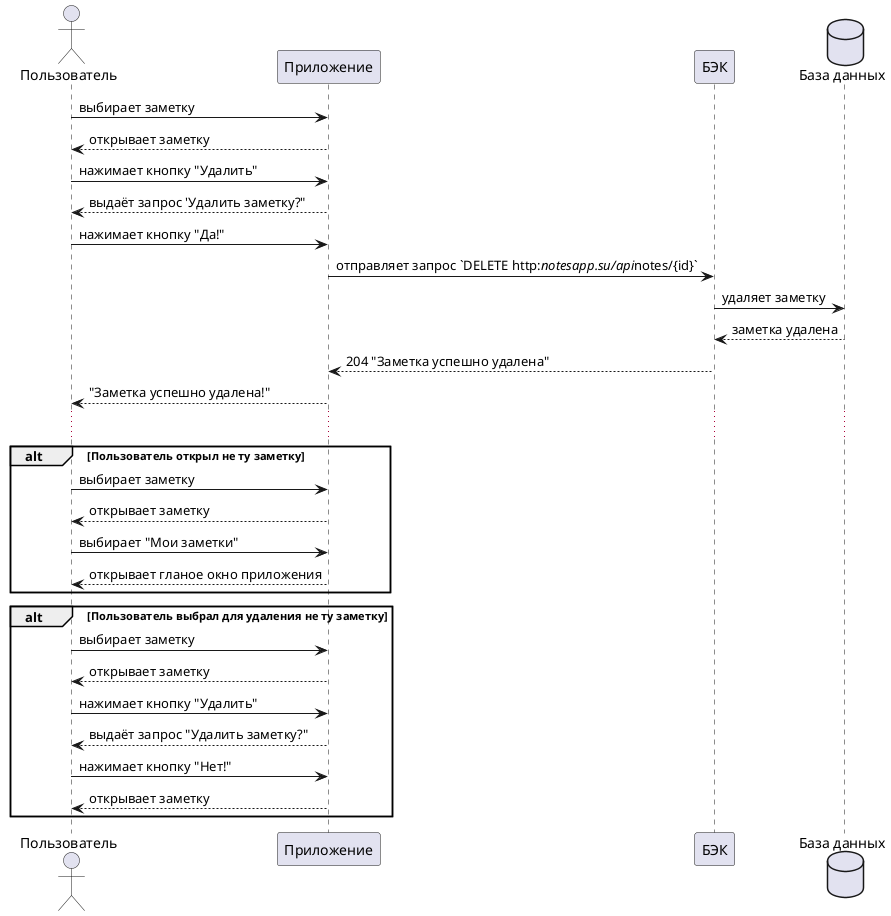

# Пользовательский сценарий приложения Нотсапп "Удаление заметки"

## Действующие лица

1. Пользователь
2. Приложение
3. БЭК
4. База данных

## Предварительные условия

Пользователь находится на главном экране.

## Выходные условия

Из системы удалена заметка.

## Основной сценарий

1. Пользователь выбирает заметку.

2. Приложение открывает заметку.

3. Пользователь нажимает кнопку **Удалить**.

4. Приложение выдаёт запрос **Удалить заметку?**.

5. Пользователь нажимает кнопку **Да!**.

6. Приложение отправляет запрос `DELETE http://notesapp.su/api//notes/{id}` БЭКу на удаление заметки.

7. БЭК удаляет заметку из Базы данных.

8. БЭК возвращает Приложению ответ 204 "Заметка успешно удалена".

9. Приложение сообщает Пользователю о том, что **Заметка успешно удалена!**.

## Альтернативный сценарий 1

1. Пользователь выбирает заметку.

2. Приложение открывает заметку.

3. Пользователь нажимает кнопку **Мои заметки**.

4. Приложение открывает гланое окно приложения.

## Альтернативный сценарий 2

1. Пользователь выбирает заметку.

2. Приложение открывает заметку.

3. Пользователь нажимает кнопку **Удалить**.

4. Приложение выдаёт запрос **Удалить заметку?**.

5. Пользователь нажимает кнопку **Нет!**.

6. Приложение открывает заметку.

[Диаграмма последовательности](Диаграмма-последовательности-Удаление-заметки.plantuml)

